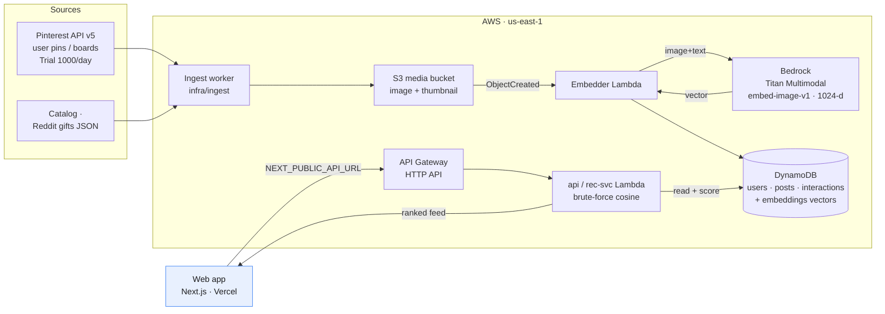
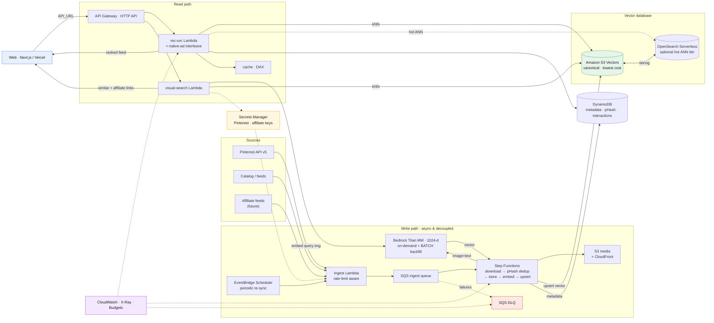

# CLOUD.md — Giftmaxxing image → vector → feed pipeline

> **What this file is.** The canonical cloud/AWS spec **and** agent memory for the
> Pinterest-image ingestion, multimodal embedding, vector indexing, recommendation,
> native-ad simulation, and (future) visual-search work. It is the "cloud" analog of
> `CLAUDE.md`: Claude Code and Devin/Cascade should treat **§8 Roadmap** as the working
> backlog for this initiative. Keep it updated as decisions land.
>
> **Audience.** Future coding agents + humans. Everything needed to *start building*
> without re-doing the research is here. Prices marked _(verify)_ are list prices that
> drift — re-check the linked AWS page before committing spend.
>
> **Repo facts.** Monorepo. `web/` = Next.js app (deploys to Vercel via GitHub).
> `infra/` = Terraform serverless backend (DynamoDB + Lambda + API Gateway HTTP API),
> **deployed** in `us-east-1`, account `445056752928`. API base:
> `https://tvyu8gqmki.execute-api.us-east-1.amazonaws.com`.
>
> **✅ Verified (live, AWS acct `445056752928` / `us-east-1`, Jun 2026):** Bedrock
> **Titan Multimodal access is GRANTED** (test invoke of `amazon.titan-embed-image-v1`
> returned a 1024-d vector). **Amazon S3 Vectors is available** in the account
> (`s3vectors list-vector-buckets` ok). **Pricing confirmed** via the AWS Price List API
> — see §7. Architecture diagrams in §11.

---

## 0. TL;DR — the decisions

| Concern | Decision | Why |
|---|---|---|
| **Embedding model** | Amazon Bedrock — **Titan Multimodal Embeddings G1** (`amazon.titan-embed-image-v1`), 1024-d (also 384/256) | Single **shared** text+image vector space → enables image↔image *and* text↔image search with one model. No servers to run, pay-per-call. |
| **Forward option** | **Amazon Nova Multimodal Embeddings** (newer, unified text/image/video/audio) | Migration target once stable; same pipeline shape. |
| **Image storage** | **Amazon S3** (private bucket, `s3:image/...`) | Cheap, event-driven, native Bedrock/OpenSearch integration. |
| **Vector database (recommended)** | **Amazon S3 Vectors** — ✅ confirmed available in acct `445056752928`/`us-east-1` | The AWS-native, purpose-built vector store: lowest TCO, scales past 100k, native Bedrock + OpenSearch integration. Use as the canonical index. See §11 for the full options list. |
| **Vector index (Phase-1 alt)** | Brute-force cosine in Lambda over vectors in DynamoDB | Zero-dependency fallback at ≤ ~10k vectors; ~$0 extra. Only if avoiding S3 Vectors. |
| **Vector index (scale/low-latency)** | OpenSearch Serverless vector engine **or** Aurora PostgreSQL Serverless v2 + `pgvector` | Only when ANN latency/filtering at >100k vectors justifies the monthly minimum. |
| **Pinterest** | API v5, OAuth 2.0, **user-scoped content only** | Pull a connected user's own pins/boards as a taste signal + idea images. No global image firehose exists in the API. |
| **Native ads** | Reuse `PostCard`, add `sponsored` flag, subtle "Sponsored" label, interleave at a cadence, **rank by the same taste vector** | Reproduces Pinterest's "I can't tell it's an ad" seamlessness. |
| **Cost at dev scale** | **≈ a few $/month** (pricing ✅ verified via AWS Price List) | Embedding 10k images ≈ **$0.60 one-time** on-demand (**$0.30 batch**); S3 pennies/mo; Bedrock has no idle cost. |

---

## 1. Pinterest ingestion

### 1.1 Rate limits (confirmed from Pinterest docs)
Source: <https://developers.pinterest.com/docs/reference/rate-limits/>

- **Trial access:** **1,000 requests / day**, across **all** endpoints combined. (Default tier when you create an app.)
- **Standard access:** **100 requests / second**, per user, per app, across all endpoints. (Granted after app review/upgrade.)
- Every response carries rate-limit headers — **read these and back off**, don't hard-code limits:
  - `x-ratelimit-limit` — e.g. `100, 100;w=1, 1000;w=60` (≈ 100/sec burst window `w=1`, 1000/min window `w=60` for Standard).
  - `x-ratelimit-remaining` — calls left in the current window.
  - `x-ratelimit-reset` — seconds until the window resets.
- Some endpoint families (e.g. `ads_analytics`, `catalogs_*`, `trends_read`) have their **own** category limits; request increases via a Pinterest support ticket.
- **Access tiers:** <https://developers.pinterest.com/docs/key-concepts/access-tiers/> — Trial also restricts created Pins/Boards (sandbox-like) and can deny requests outside the trial scope.

**Implication for us:** Trial's 1,000/day is plenty to onboard a connected user's boards/pins for taste signals. A page of 100 pins = 1 request, so a user with 2,000 saved pins ≈ 20 requests. Batch onboarding of many users at once needs Standard access + a queued, header-aware ingestion worker.

### 1.2 Auth & access model
- **OAuth 2.0** authorization-code flow. Store `PINTEREST_CLIENT_ID` / `PINTEREST_CLIENT_SECRET`; redirect via `PINTEREST_REDIRECT_URI`.
- Relevant **scopes** (read-only): `user_accounts:read`, `boards:read`, `pins:read`. (Add `:write` only if we ever create pins.)
- **Critical constraint:** Pinterest API v5 exposes the **authenticated user's own content** (their pins/boards) plus ads/catalog endpoints. **There is no public "search all of Pinterest" image firehose.** So the realistic product flow is exactly the app's existing copy — *"Link a Pinterest board or recent saves so Maxi learns each person's taste."* Idea images in the feed come from **connected users' own boards** (with rights) and/or **our own catalog**, not scraped global content.
- **Terms / rights / privacy:** honor the Pinterest Developer Guidelines + data-retention/deletion obligations. Prefer to **store image URLs + a small cached thumbnail + a perceptual hash**, not full-resolution redistribution. Delete a user's derived data on disconnect.

### 1.3 Endpoints we use
Base: `https://api.pinterest.com/v5`

| Method | Path | Purpose |
|---|---|---|
| GET | `/user_account` | Connected profile |
| GET | `/boards` | List the user's boards (cursor paginated) |
| GET | `/boards/{board_id}/pins` | Pins on a board |
| GET | `/pins` | List the user's pins |
| GET | `/pins/{pin_id}` | A single pin → includes `media.images` |
| GET | `/search/pins?query=` | Search the **user's own** pins |

- **Pagination:** cursor-based via the `bookmark` query param; `page_size` up to 100.
- **Pin `media.images`** comes in sizes: `150x150`, `400x300`, `600x`, `1200x`, `originals` — each `{ url, width, height }`. Use `600x`/`1200x` for embedding, `150x150` for the cached thumbnail.
- **What we extract per pin:** `id`, best image `url`, `title`/`description`/`alt_text` (text side of the embedding), `board`, destination `link`, dominant color, dimensions.

### 1.4 Query filters (what the API can actually filter on)
User-scoped only — **no global search**. Available filters:
- **`/boards`** — `page_size` (1–250), `bookmark`, `privacy` = `ALL|PUBLIC|PROTECTED|SECRET`.
- **`/pins`** — `page_size`, `bookmark`, `creative_types` = `REGULAR,VIDEO,SHOPPING,CAROUSEL,MAX_VIDEO,SHOP_THE_PIN,COLLECTION,IDEA`, `pin_filter=exclude_native`, `include_protected_pins`, `pin_metrics`.
- **`/boards/{id}/pins`** — same `creative_types` + pagination; plus board **sections**.
- **`/search/pins?query=` / `/search/boards?query=`** — free-text over the **user's own** content only.
- **No server-side date filter** — pins carry `created_at`; filter client-side.
- Merchant **`/catalogs/*`** endpoints add product-feed filters (only if we run a catalog).

### 1.5 Status & the public-RSS scraper (✅ IMPLEMENTED)
- **⛔ v5 content API is blocked for our app:** the token-shaped `PINTEREST_API_KEY` returns **HTTP 401 `{"code":3,"message":"Your application consumer type is not supported, please contact support."}`** on `/v5/user_account` and `/v5/boards`. This is an **app-approval / consumer-type** problem on Pinterest's side (needs Standard access / correct app type), not a code bug. OAuth isn't wired yet (no `CLIENT_ID/SECRET`).
- **✅ Fallback in use — public RSS (no auth):** Pinterest still serves `https://www.pinterest.com/<user>/feed.rss` and `…/<user>/<board>.rss` (verified HTTP 200, valid RSS). Each `<item>` → pin `<link>`, `<title>`, `<pubDate>`, and `` inside `<description>`; we upgrade `236x → originals` for full-res.
- **Scraper:** `infra/ingest/pinterest-rss.mjs` — fetch feeds → parse → download → upload to **S3** (`MEDIA_BUCKET`, key `images/pin-<id>.jpg`, ASCII metadata) → write `pins.manifest.json`. Flags: `--users a,b`, `--boards user/board`, `--limit`, `--skip-existing`, `--dry-run`, `--bucket`, `--prefix`. Run: `set -a; source ../../.env; set +a` then `npm run scrape:pinterest -- --users etsy,marthastewart`.
- **First run (Jun 2026):** 72 pins from `etsy,marthastewart,uncommongoods` → **`s3://giftmaxxing-dev-media/images/` (72 objects, ~10 MiB, image/jpeg)**. Idempotent via `--skip-existing`.
- **Limitations:** public boards only, ~25 recent pins/feed, less metadata than the API. Swap to the official API (OAuth) once the app is approved — the embed/S3 steps are identical.

---

## 2. Embedding on AWS

### 2.1 Model: Titan Multimodal Embeddings G1 (Bedrock)
- Model id: `amazon.titan-embed-image-v1`. Call via Bedrock `InvokeModel`.
- **Input:** an image (base64) and/or a text string. **Output:** one float vector in a **shared** space — default **1024 dims** (request `256` or `384` for cheaper storage/faster search via `embeddingConfig.outputEmbeddingLength`).
- **Why shared-space matters:** the same model embeds *both* the product/idea image *and* a text query (e.g. "warm cozy film-camera vibe"). So we get, for free:
  - **image → image** ("more like this pin"),
  - **text → image** (taste words → matching images),
  - **image → product** (the future visual search).
- **Input limits (verify in model docs):** image ≤ ~25 MP / a few MB after base64; long text is truncated to the model's token cap. Downscale to ≤1024px before sending.
- Request shape (illustrative):
  ```json
  { "inputImage": "<base64>", "inputText": "matcha starter kit, cozy kitchen",
    "embeddingConfig": { "outputEmbeddingLength": 1024 } }
  ```
  Response: `{ "embedding": [ ...1024 floats... ] }`.
- **Newer alternative:** Amazon **Nova Multimodal Embeddings** — same idea, broader modalities; treat as the migration target. Cohere Embed (Image) v3 is also on Bedrock.

### 2.2 Pipeline (ingest → embed → store)
```
Pinterest API ─┐
our catalog   ─┼─▶ S3 (raw/derived image)  ──(S3:ObjectCreated)──▶  Lambda "embedder"
affiliate feed ┘                                                          │
                                          Bedrock InvokeModel (Titan MM)  │
                                                          ▼               ▼
                                   vector + metadata ──▶ DynamoDB (Phase 1)  /  S3 Vectors (Phase 2)
```
- **Real-time:** S3 put event → `embedder` Lambda → Bedrock → write `{id, vector, dims, source, hash, tags, link}` to the vector store + a row in `posts`/`images`.
- **Backfill:** a batch script mirroring `infra/ingest/ingest.mjs` (read JSON → embed in chunks → BatchWrite). For large one-shot backfills use **Bedrock batch inference** (async, cheaper).
- **Dedup:** perceptual hash (pHash) before embedding to skip near-duplicate pins.

---

## 3. Storage & indexing

### 3.1 S3 (images)
- Private bucket `giftmaxxing-<env>-media`, keys `image/{sha256}.jpg` + `thumb/{sha256}.jpg`.
- Serve to the web app via CloudFront or pre-signed URLs (or just keep Pinterest's CDN URL + our thumbnail if rights require).

### 3.2 DynamoDB (Phase 1 vector home + metadata)
Add an `embeddings` table (or extend `posts`):
- PK `itemId`; attributes: `vector` (list<number> or binary), `dims`, `source` (`pinterest|catalog|affiliate`), `ownerId` (for user-scoped pins), `pHash`, `tags`, `link`, `createdAt`.
- GSI `bySource` for backfills/filtered scans.

### 3.3 Vector index — phased
| Phase | Approach | When | ~Cost |
|---|---|---|---|
| **1 — now** | **Brute-force cosine in Lambda.** Load candidate vectors from DynamoDB (or one Parquet/JSON blob in S3) into memory, compute cosine, top-k. | ≤ ~10k–100k vectors | **~$0** beyond DynamoDB storage (pennies) |
| **2 — managed-cheap** | **Amazon S3 Vectors.** Put vectors to a vector bucket/index; query top-k. Native Bedrock + OpenSearch integration. | 100k–10M+, infrequent queries | storage/GB + per-query _(verify)_ — lowest TCO of the managed options |
| **3 — low-latency ANN** | **OpenSearch Serverless** vector engine *or* **Aurora PG Serverless v2 + pgvector** | real-time filtered ANN at scale | OpenSearch Serverless has a **monthly minimum** (OCU-based, ~$350+/mo for 2-OCU dev/test, historically ~$700 with redundancy) _(verify)_ — **avoid until scale justifies it** |

Start at Phase 1 (zero new spend, fits current infra). Promote to Phase 2 (S3 Vectors) when the catalog crosses tens of thousands of items.

---

## 4. Recommendation feed integration

Today the ranker (`web/lib/recommend.ts`, mirrored server-side in `infra/src/handler.mjs`) builds a taste vector over **hand-tagged "vibes"**. The embedding pipeline upgrades this without changing the feed UI:

- **Taste vector → embedding centroid.** Instead of (or blended with) vibe weights, compute the **mean embedding of the items the user liked/saved** (and a discounted mean of followed authors' items). That centroid *is* the taste vector.
- **Candidate scoring.** For each candidate (catalog product, embedded Pinterest idea pin, or sponsored item), score = **cosine(taste centroid, candidate embedding)**, then blend with the existing price-fit / social-proof / follow signals (keep the `W` weights, swap the `taste` term).
- **"Photo ideas" cards.** Embedded Pinterest pins surface in the feed as inspiration cards ("photo ideas") ranked by the same cosine — they need not be buyable; tapping can deep-link to the source or to similar buyable products (see §6).
- **Server move.** This is the `rec-svc` upgrade: `GET /recommendations` queries the vector index (Phase 1 brute-force now) instead of the random/likes placeholder in `handler.mjs`.

---

## 5. Native (seamless) ads — Pinterest-style

### 5.1 What makes Pinterest ads feel organic (the pattern to copy)
- **Same card, same grid.** A Promoted Pin uses the **exact same component** as an organic Pin — same image-first layout, aspect ratios, hover/tap behavior. No banner, no separate "ad slot" chrome, no different background.
- **Minimal disclosure.** The only tell is a small, low-contrast **"Promoted" / "Promoted by {advertiser}"** label (muted text near the attribution), plus a `…` menu with **"Why am I seeing this ad?"** / hide. No loud "AD" badge.
- **Relevance-placed.** Ads are interleaved into the organic feed at intervals and chosen by the **same relevance/taste model**, so the sponsored item matches the surrounding vibe — that's *why* it's hard to distinguish.
- **Same interactions.** Save / click / comment / hide work identically; hiding feeds "fewer ads like this." CTA ("Visit"/"Shop") appears on closeup/hover, not as an intrusive grid button.

### 5.2 Giftmaxxing implementation
- Extend `Post` (`web/lib/social.ts`): `sponsored?: boolean; advertiser?: string; cta?: "Shop" | "Visit"`.
- Render in `PostCard` (`web/components/app/post-card.tsx`) using the **same card**; in the header slot where `rec` shows `Suggested · {reason}`, show a muted **`Sponsored`** (+ optional `· {advertiser}`) and a `…` → "Why am I seeing this?". Reuse the existing product chip as the subtle CTA.
- **Interleave** sponsored items in `recommendPage()` at a fixed cadence (e.g. 1 in every 5–6 posts) **but rank them by the same taste centroid** so they match the user's vibe. Apply a frequency cap and respect "hide."

---

## 6. Visual search — "Google Lens for gifts" (FUTURE, indexed for later agents)

> **Status: future / not built yet.** Documented + indexed here so a later agent can pick it up.

**Goal.** User uploads/snaps a photo → we return **visually similar, buyable products with Amazon/Walmart affiliate links** (à la Google Lens).

**Pipeline (reuses everything above):**
1. `POST /visual-search` (multipart image) → Lambda.
2. Embed the query image with the **same** Titan Multimodal model → query vector.
3. **kNN** against the product/affiliate catalog vectors (Phase 1 brute-force → Phase 2 S3 Vectors).
4. Enrich top-k with **affiliate links** and return.

**Affiliate sources (need approval + secrets):**
- **Amazon Associates** — Product Advertising API (PA-API 5.0) for product data; append the associate tag to links. Keys: `AMAZON_ASSOCIATES_*`.
- **Walmart** — Walmart Affiliate Program (Impact) + Walmart Affiliate/IO API. Keys: `WALMART_AFFILIATE_*`.
- Never hard-code keys; store in env/secrets manager.

**Also enables:** "shop this pin" — turn a Pinterest idea image into buyable lookalikes via the same kNN.

---

## 7. AWS resources & cost summary

All us-east-1. Bedrock prices ✅ **verified via the AWS Price List API** (`AmazonBedrock`, Jun 2026); others are list prices _(verify)_. Dev-scale assumption: ~10k images, light query traffic.

| Resource | Role | Unit price | Dev-scale cost |
|---|---|---|---|
| **Bedrock — Titan Multimodal Embeddings G1** ✅ | image/text → vector | **$0.00006 / image**, **$0.0008 / 1K text tokens** (on-demand); **batch −50%: $0.00003 / image, $0.0004 / 1K** | **~$0.60 one-time** for 10k images (**$0.30 batch**). **No idle cost.** |
| **Bedrock — Nova Multimodal Embeddings** ✅ | newer alt (text/img/video/audio) | $0.00006 / image, $0.000135 / 1K tokens (+ video $0.0007/s, audio $0.00014/s) | similar; choose if you need video/audio |
| **Amazon S3 Vectors** ✅ available | **canonical vector DB** | vector storage/GB-mo + per-query / data-scanned _(verify exact)_ | low — "lowest TCO" managed vector store |
| **S3 (Standard)** | image + thumbnail store | ~$0.023 / GB-mo | 10k imgs ≈ 2 GB ≈ **~$0.05 / mo** |
| **DynamoDB (on-demand)** | metadata (+ Phase-1 vectors) | ~$1.25 / M writes, $0.25 / M reads, $0.25 / GB-mo | **pennies / mo** |
| **Lambda** | embedder + kNN + API | free tier then ~$0.20 / M req + GB-s | **~$0 / mo** |
| **OpenSearch Serverless** (optional hot tier) | low-latency ANN at scale | OCU-based, ~$0.24 / OCU-hr | **~$350+/mo minimum** — avoid until scale |
| **Bedrock Provisioned Throughput** ✅ | high constant throughput | ~$9.38 / hr (Titan MM image, no-commit) | **avoid** — on-demand is far cheaper here |

**Bottom line:** the whole image→vector→feed pipeline runs at **≈ a few dollars/month** at dev scale — embedding is a sub-dollar one-time (verified), image storage is pennies, and S3 Vectors is the lowest-cost managed vector DB. The only steps with real monthly cost are OpenSearch Serverless (a hot tier, only at scale) and Provisioned Throughput (don't) — avoid both until traffic demands them.

---

## 8. Roadmap (working backlog — agents: execute top-down)

- [x] **P0 Pinterest image scrape (public RSS)** — `infra/ingest/pinterest-rss.mjs` → S3. **Done** (72 imgs → `giftmaxxing-dev-media`, see §1.5). ⏳ Official OAuth puller still pending (v5 app blocked: "consumer type not supported").
- [x] **P0 Embedder (backfill)** — `infra/ingest/embed.mjs`: S3 image + title → Titan MM → `put-vectors` into S3 Vectors. **Done** (72 vectors in `giftmaxxing-dev-vectors/pins`, see §13). ⏳ S3-ObjectCreated Lambda trigger + Bedrock **batch** for bulk still pending.
- [x] **P0 Infra** — ✅ S3 media bucket (`infra/s3.tf`), ✅ **S3 Vectors bucket+index** (`giftmaxxing-dev-vectors/pins`, script-managed via `infra/ingest/s3vectors-setup.mjs` — no TF resource yet), ✅ API Lambda **s3vectors read IAM** (`infra/iam.tf`) + `VECTOR_BUCKET`/`VECTOR_INDEX` env. ⏳ DynamoDB `pins` table + S3-event embedder Lambda still pending.
- [x] **P1 Rec upgrade (server)** — ✅ `handler.mjs` `/recommendations` builds a taste centroid (`get-vectors`) → `query-vectors` (kNN) with optional `sourceUser` filter, falling back to facet `scorePost` when no vectors (`source:"vector"|"facet"` in the response). Live & tested (§13). ⏳ `web/lib/recommend.ts` client still facet-based; wire the feed UI to the vector results next.
- [ ] **P1 Native ads** — `Post.sponsored`, `PostCard` label + CTA, interleave by cadence ranked by taste, frequency cap + hide.
- [ ] **P2 Harden write path (optimized arch, §12.2)** — SQS + DLQ between ingest and embed, Step Functions orchestration, pHash dedup, EventBridge re-sync, Secrets Manager, observability. Add OpenSearch hot tier only if real-time ANN latency at scale demands it.
- [ ] **P3 Visual search** — `POST /visual-search`, image→embed→kNN→**Amazon/Walmart affiliate** enrich. (See §6.)

## 9. Env vars / secrets (add to `.env`, never commit)
```
PINTEREST_CLIENT_ID=
PINTEREST_CLIENT_SECRET=
PINTEREST_REDIRECT_URI=
PINTEREST_API_KEY=            # present, but v5 rejects it (consumer type) -> using RSS for now
PINTEREST_RSS_USERS=etsy,marthastewart,uncommongoods   # public-RSS scraper sources (infra/ingest/pinterest-rss.mjs)
BEDROCK_EMBED_MODEL_ID=amazon.titan-embed-image-v1
MEDIA_BUCKET=giftmaxxing-dev-media
VECTOR_BUCKET=giftmaxxing-dev-vectors   # S3 Vectors bucket (recommendation kNN)
VECTOR_INDEX=pins                        # S3 Vectors index (1024-d, cosine)
# Future — visual search affiliate enrich:
AMAZON_ASSOCIATES_ACCESS_KEY=
AMAZON_ASSOCIATES_SECRET_KEY=
AMAZON_ASSOCIATES_PARTNER_TAG=
WALMART_AFFILIATE_CONSUMER_ID=
WALMART_AFFILIATE_PRIVATE_KEY=
```

## 10. Open questions / status
- ✅ **Titan MM pricing verified** via AWS Price List API ($0.00006/image, $0.0008/1K tokens; batch −50%). See §7.
- ✅ **Bedrock Titan Multimodal access GRANTED** in `445056752928`/`us-east-1` (test invoke → 1024-d vector).
- ✅ **Amazon S3 Vectors available** in the account (`s3vectors list-vector-buckets` ok).
- ⏳ Verify exact **S3 Vectors** unit pricing (storage/GB + per-query) on the S3 pricing page before bulk load.
- ⏳ Confirm Pinterest app is on **Trial** vs **Standard** (governs batch onboarding throughput).
- ⏳ Decide image-rights posture: cache thumbnails vs. reference Pinterest CDN URLs only.

---

## 11. AWS vector database options ("does Amazon have a vector DB?")

Yes. AWS has no single product literally named "VectorDB", but several native options. Ranked for this project:

| Option | What it is | Use it when | Cost shape |
|---|---|---|---|
| **Amazon S3 Vectors** ✅ (recommended) | Purpose-built **vector storage in S3** — first cloud object store with native vector support; sub-second similarity queries; native Bedrock Knowledge Bases + OpenSearch integration. | Canonical store for our catalog/pin vectors at any scale; cheapest. | storage/GB-mo + per-query (lowest TCO) |
| **Amazon OpenSearch Serverless** (vector engine) | Managed k-NN (HNSW/FAISS), filtering, hybrid search, low-latency ANN. | Optional **hot tier** for real-time ANN at scale; tiers from S3 Vectors. | OCU-based, ~$350+/mo min |
| **Aurora PostgreSQL / RDS + `pgvector`** | Relational DB + vector column/index. | If you want SQL + vectors together; Aurora Serverless v2 scales down. | instance/ACU-hr + storage |
| **Amazon MemoryDB / ElastiCache (Redis) vector search** | In-memory ANN, single-digit-ms latency. | Ultra-low-latency, smaller hot sets. | node-hours (pricier) |
| **Amazon DocumentDB / Neptune Analytics** | Vector search in a document DB / graph-analytics engine. | If the data already lives there. | engine-specific |
| **Bedrock Knowledge Bases** | Managed embed+store+retrieve on top of one of the above (OpenSearch / S3 Vectors / Aurora / Pinecone…). | If you want managed RAG rather than a custom recommender. | underlying store + Bedrock |

**Decision:** **S3 Vectors** is the canonical vector DB now (confirmed available, lowest cost). Add **OpenSearch Serverless** as a hot tier only if/when real-time ANN latency at scale requires it. Keep **DynamoDB** for item metadata.

---

## 12. Architecture diagrams

> Render locally: `python3 -m http.server` inside `/tmp/giftmaxxing-diagrams/` and open it, or just read the Mermaid below (GitHub renders it).

### 12.1 Current plan (as designed — simple; review this first)



### 12.2 Optimized (Well-Architected — event-driven, real vector DB)



**Optimizations over 12.1 (sanity checks):**
- **Real vector DB (S3 Vectors)** replaces brute-force-in-Lambda as the canonical index; OpenSearch only as an optional hot tier (keep its monthly minimum out of the critical path).
- **SQS + DLQ** decouple ingest from embed → smooths Pinterest's 1000/day cap, enables retries/backoff, isolates failures.
- **Step Functions** orchestrate the multi-step flow instead of Lambda-chaining (visibility, retries, idempotency).
- **Perceptual-hash dedup** before embedding cuts cost + feed noise; **content-hash keys** make re-runs idempotent (never re-embed).
- **Bedrock BATCH** for backfills (−50%); on-demand for incremental.
- **EventBridge Scheduler** for periodic board re-sync; **Secrets Manager** for keys (not `.env` in prod).
- **DAX cache** for hot recs; **CloudFront** for image delivery; consider **256/384-d** embeddings to cut vector storage/query cost.
- **Observability**: CloudWatch alarms (esp. DLQ depth) + X-Ray + an **AWS Budgets** cost-guardrail alarm.
- **Visual search reuses the same vector DB** (image query → same model → kNN → affiliate enrich).

---

## 13. Vector pipeline — IMPLEMENTED (Jun 2026)

The image → embedding → vector → recommendation loop is **live** end-to-end on AWS (`us-east-1`).

**Resources**
- **S3 Vectors:** bucket `giftmaxxing-dev-vectors`, index `pins` (1024-d, cosine, float32; non-filterable metadata: title/pinUrl/imageUrl/s3Key). ARN `arn:aws:s3vectors:us-east-1:445056752928:bucket/giftmaxxing-dev-vectors/index/pins`. Script-managed (no Terraform resource yet — provider support TBD).
- **72 vectors** loaded from the scraped pins.
- **API Lambda** `giftmaxxing-dev-api`: bundles `@aws-sdk/client-s3vectors` (not in the nodejs20.x runtime SDK), env `VECTOR_BUCKET`/`VECTOR_INDEX`, IAM `s3vectors:QueryVectors|GetVectors|ListVectors` on the index.

**Scripts** (`infra/ingest/`, run after `set -a; source ../../.env; set +a`)
- `npm run vectors:setup` — create bucket + index (idempotent).
- `npm run embed` — manifest → S3 image + title → Titan MM (`amazon.titan-embed-image-v1`) → `put-vectors`. Flags `--limit`, `--dry-run`.
- `npm run vectors:query -- --text "cozy mug"` (text→image) or `-- --key pin-123` (image→image "more like this"); `--user etsy` filters by `sourceUser`.

**Read path** (`infra/src/handler.mjs`, `GET /recommendations`)
1. Seeds = `?seedKeys=pin-a,pin-b` or the user's interactions.
2. `get-vectors(seeds)` → average → **taste centroid**.
3. `query-vectors(centroid, topK, filter=sourceUser?)` → neighbors (metadata + distance) → post-shaped items, `source:"vector"`.
4. No seeds / no vectors → DynamoDB scan + `scorePost`, `source:"facet"` (unchanged, backwards-compatible).

**Verified live:** `GET /recommendations?seedKeys=pin-…` → `source:vector`, neighbors at ~0.70–0.84 cosine; `GET /recommendations` (no seeds) → `source:facet`.

**Caveats / next:** stored vectors are image+title (titles are marketing copy → text→image matches are loose; image→image is tight). Pins aren't in the DynamoDB `posts` table yet, so the **feed UI** still renders Reddit posts — to show pins in the feed, ingest pins as posts (or render directly from vector metadata) and have the client call the vector path. Move bulk embeds to Bedrock **batch** (−50%) and add the S3-ObjectCreated trigger for incremental.
