<h1 align="center">Giftmaxxing 🎁</h1>

  <b>Gift-giving is a craft.</b> 
  Giftmaxxing learns the taste of the people you love, remembers every date that
  matters, and turns <i>“I have no idea what to get them”</i> into the perfect
  gift — on your own or as a group.

  <a href="https://giftmaxxing.vercel.app"><b>🌐 Live app</b></a> &nbsp;·&nbsp;
  <a href="#-learn-their-taste-by-swiping"><b>The swipe flow</b></a> &nbsp;·&nbsp;
  <a href="#-feature-tour"><b>Feature tour</b></a> &nbsp;·&nbsp;
  <a href="#monorepo-layout"><b>Under the hood</b></a>

---

## Three gifts, up top

<table>
<tr>
<td width="33%" valign="top" align="center">

### 🎁 Know their taste

Swipe a handful of finds and Giftmaxxing learns what someone <i>actually</i> wants — no awkward asking.

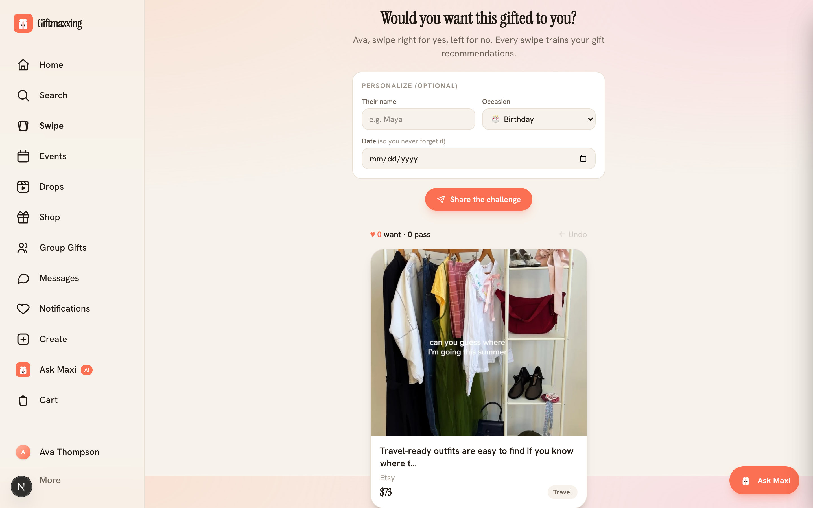

</td>
<td width="33%" valign="top" align="center">

### 🎁 Never forget a date

Birthdays, milestones and shared occasions — tracked, with reminders and ideas ready <i>before</i> the day.

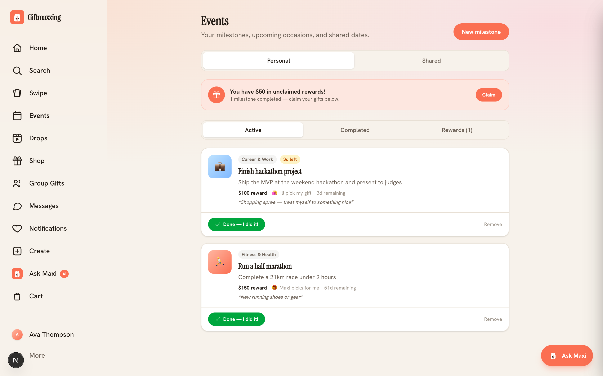

</td>
<td width="33%" valign="top" align="center">

### 🎁 Gift-giving is a craft

A taste-ranked feed, an AI concierge and curated drops help you give something thoughtful, every time.

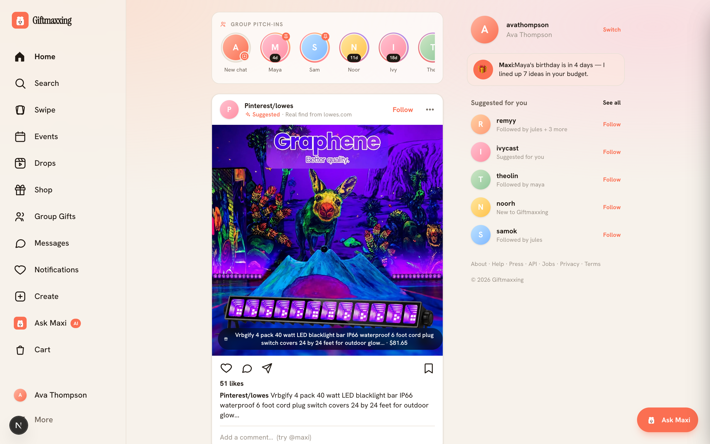

</td>
</tr>
</table>

---

## ✨ Learn their taste by swiping

The signature flow. Swipe **right** on what fits, **left** on what doesn’t — every
“yes” sharpens a taste vector that powers your gift matches. Send the challenge to
a friend and a **soft profile** of *their* taste lands in your account (with their
okay), so you’re never guessing again.

  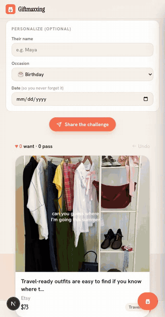

Five “wants” unlock a ranked set of gift matches, blended from your swipe taste.

---

## 🧭 Feature tour

Everything Giftmaxxing does, section by section.

### 📅 Never forget a date — Events & milestones

Personal and shared timelines for birthdays, anniversaries and goals. Each milestone
carries a reward and surfaces gift ideas as the date approaches.

### 👥 Group gifts that actually land

Pool money toward one great gift — everyone chips in, nobody double-buys. Live
progress bars, contributor avatars, and an **Invite** button to bring people in
(in-app or via a share link, with a clear no-payments-handled disclaimer).

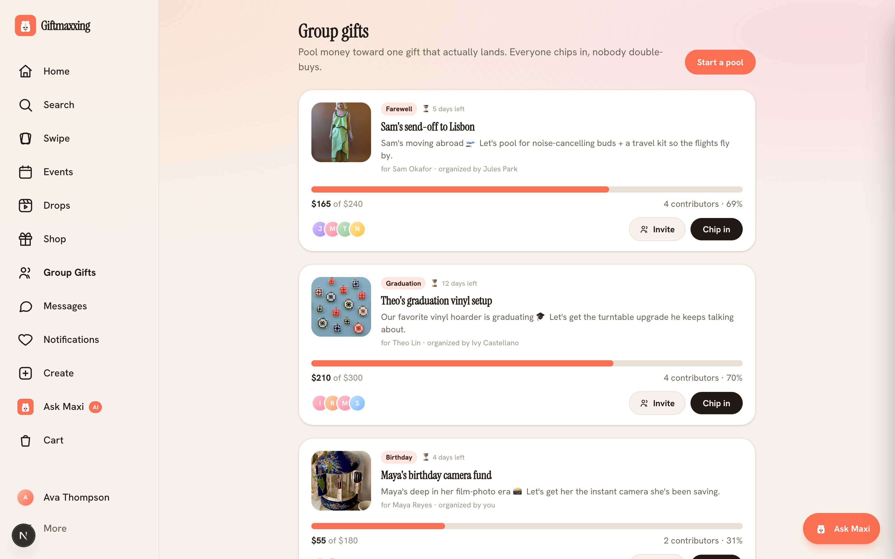

### 🤖 Maxi — your AI gift concierge

Tell Maxi a budget, a vibe, or who it’s for. It finds the gift, adds it to your
cart, and can even check out for you.

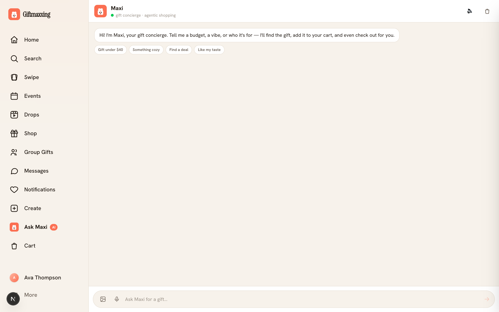

### 🏠 A feed of giftable finds

The home surface: a taste-ranked feed of gift-worthy finds, group pitch-in chats,
people to follow, and Maxi nudges (“their birthday is in 4 days — I lined up 7
ideas in your budget”).

### 🎀 Curated drops

Hand-assembled gift bundles — themed, refreshed, and ready to gift together or add
to cart in one tap.

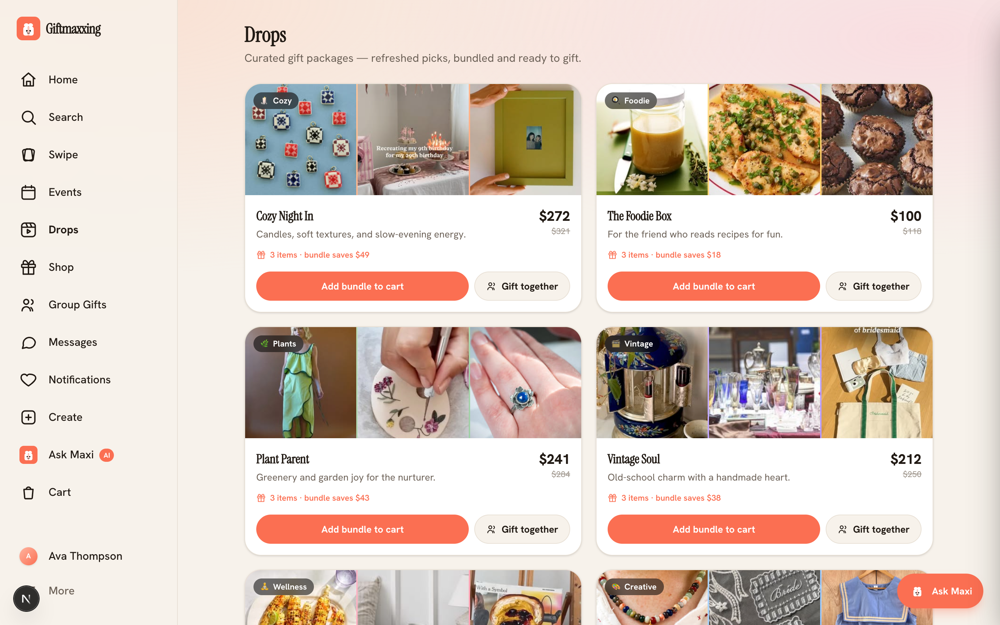

### 🛍️ Shop

Hundreds of hand-picked gifts on Amazon. Affiliate-supported, with a clear
Associates disclosure — prices and availability shown on Amazon.

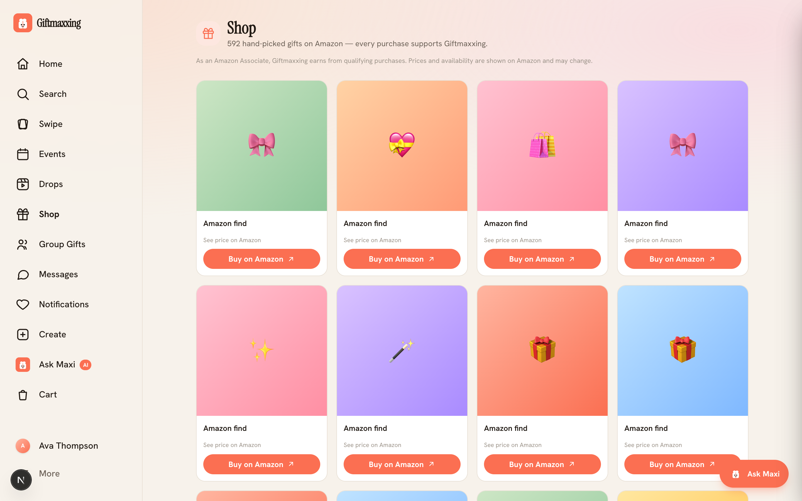

### 🙋 Your gifting profile

A profile built from your onboarding taste — your gifting role, style and budget,
the things you’re into, a **public/private** toggle, and your posts + friends
(soft profiles you’ve collected). No vanity follower counts.

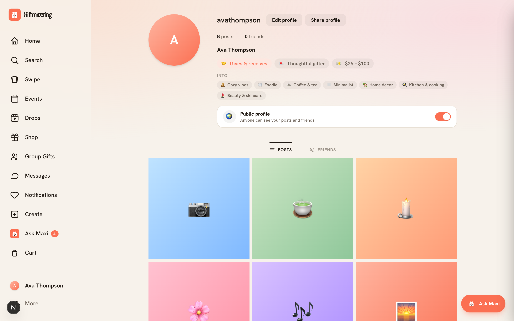

### 🔔 Activity

Everything happening around your gifting — reward unlocks, price drops on your
radar, pool contributions, claims from your wishlist, and new followers.

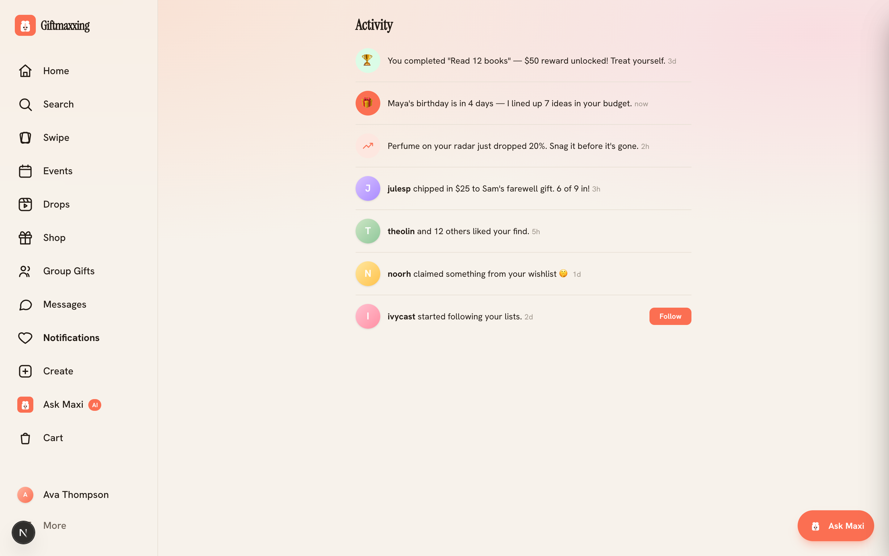

### 🧪 Recommendations Lab

A side-by-side demo of the recommender: pick a persona and compare the client-side
**facet ranker** against the server-side **S3 Vectors** recommender, with the
computed taste vector visualized.

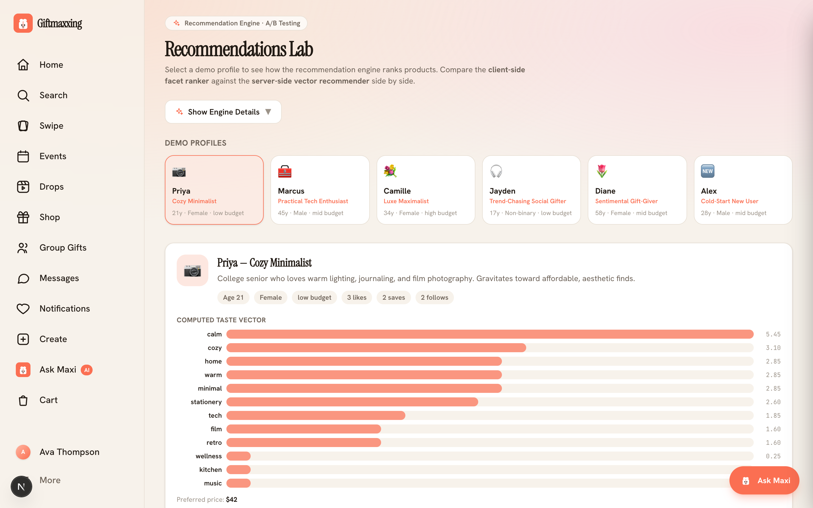

### 🚀 Onboarding

A short wizard captures the taste signals that feed every recommendation — name,
gifting role, style, budget and interests.

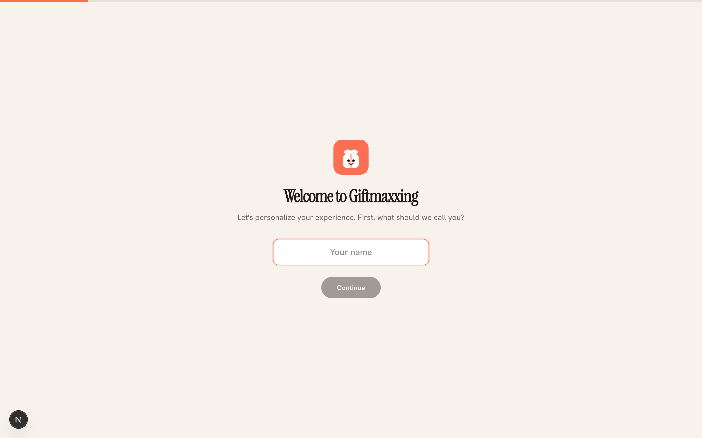

---

## 📱 Built for mobile, too

<table>
<tr>
<td width="25%" align="center">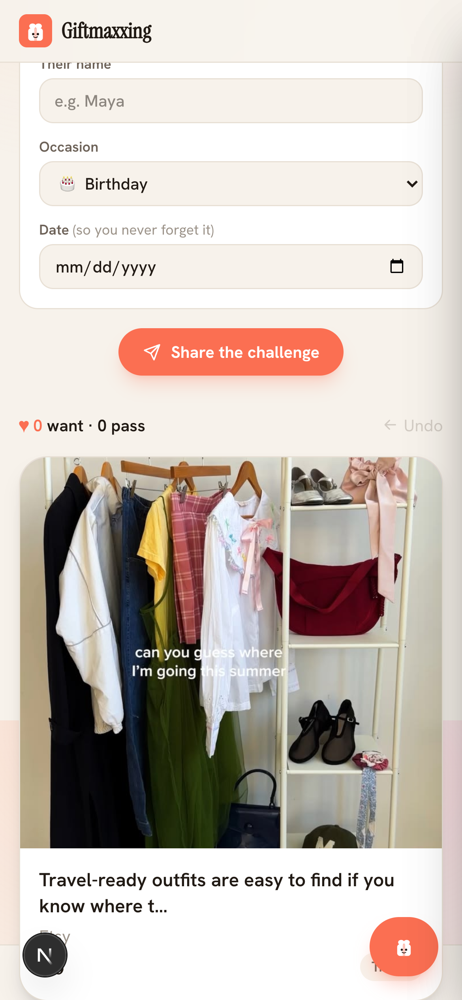 Swipe</td>
<td width="25%" align="center">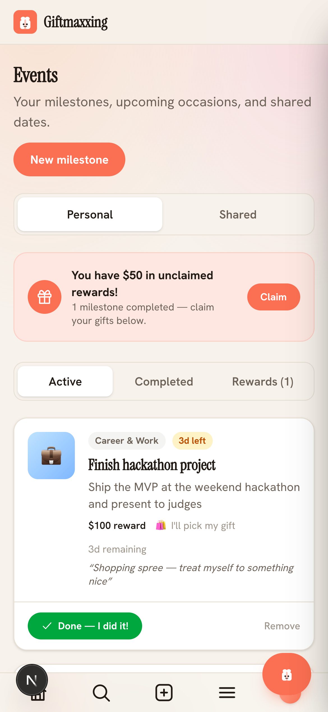 Events</td>
<td width="25%" align="center">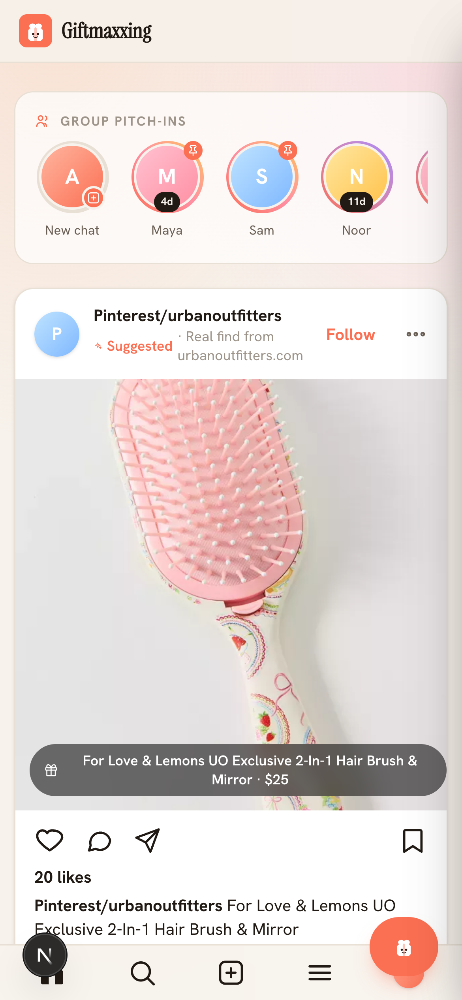 Feed</td>
<td width="25%" align="center">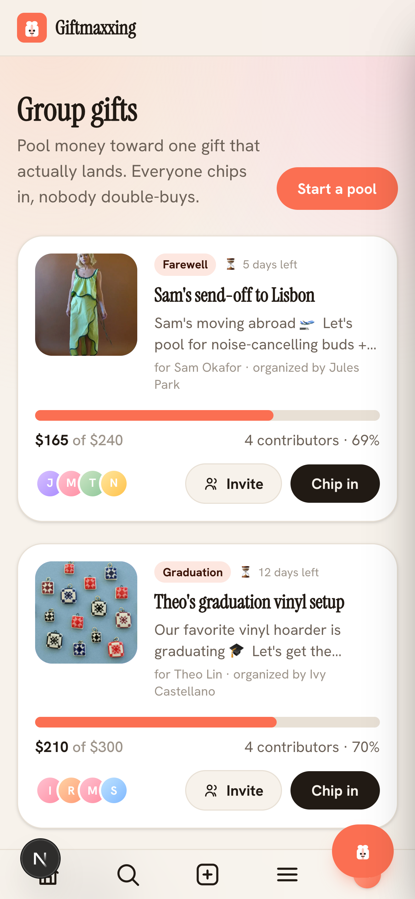 Group gifts</td>
</tr>
</table>

> Screenshots and the GIF are generated with Playwright against the local app
> (`web/`). To refresh them, run the dev server and re-run the capture script.

---

## Monorepo layout

| Path | What | Deploys to |
|---|---|---|
| `web/` | Next.js app (feed, recommender UI, landing) | **Vercel** (GitHub auto-deploy on push to `main`; Root Directory = `web`) |
| `infra/` | Terraform serverless backend: DynamoDB + Lambda + API Gateway HTTP API | **AWS** `us-east-1` (deployed) |
| `infra/ingest/` | Reddit → DynamoDB data-loading scripts | run locally |

The web app calls the AWS API via `NEXT_PUBLIC_API_URL`.

## Specs & roadmap (read these first)

| Doc | Purpose |
|---|---|
| **[`CLOUD.md`](./CLOUD.md)** | **Canonical cloud/AWS spec + agent memory** for the Pinterest-image → multimodal-embedding → vector-index → recommendation pipeline, the Pinterest-style **native-ad simulation**, cost analysis, and the **future visual-search** feature. Agents: treat `CLOUD.md` §8 as the working backlog. |
| [`infra/README.md`](./infra/README.md) | Terraform resources, deploy steps, API routes, planned embedding pipeline. |
| [`web/README.md`](./web/README.md) | Next.js app dev instructions. |

## Image → vector → feed pipeline (summary)

Connected **Pinterest** boards/pins (taste signal, user-scoped) and our catalog →
**Amazon S3** → **Amazon Bedrock Titan Multimodal Embeddings** (unified text+image
vectors) → vector index (brute-force in Lambda now → **Amazon S3 Vectors** at scale)
→ blended into the recommendation feed by cosine similarity. Sponsored items are
interleaved **seamlessly** (same card, subtle "Sponsored" label, ranked by the same
taste vector), mirroring Pinterest's native-ad pattern. Full design, rate limits, and
cost (≈ a few $/mo at dev scale) live in [`CLOUD.md`](./CLOUD.md).

### Future: visual search ("Google Lens for gifts")

Upload/snap a photo → embed with the same multimodal model → kNN against the product
catalog → return visually similar buyable products with **Amazon / Walmart affiliate
links**. Not built yet — designed and indexed in [`CLOUD.md` §6](./CLOUD.md) for a
later agent to implement.

## Getting started

- Web: see [`web/README.md`](./web/README.md).
- Infra: see [`infra/README.md`](./infra/README.md).
- Copy `.env.example` → `.env` and fill in real values (never commit `.env`).