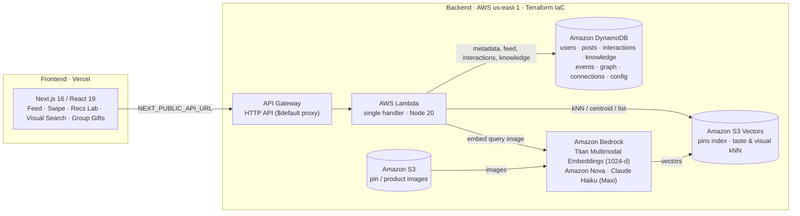
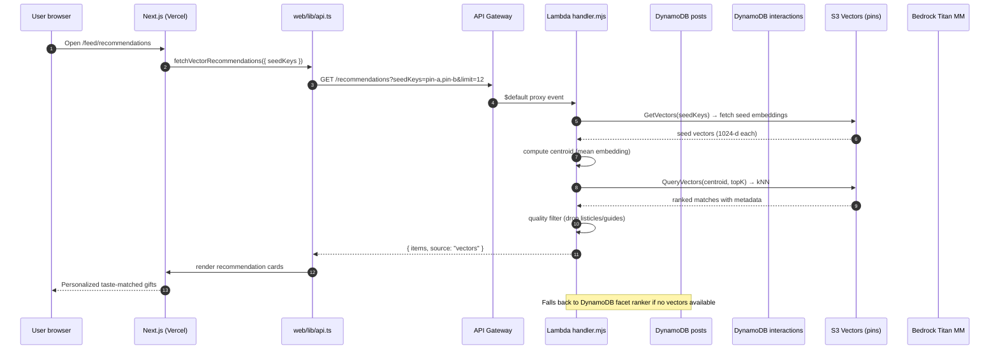
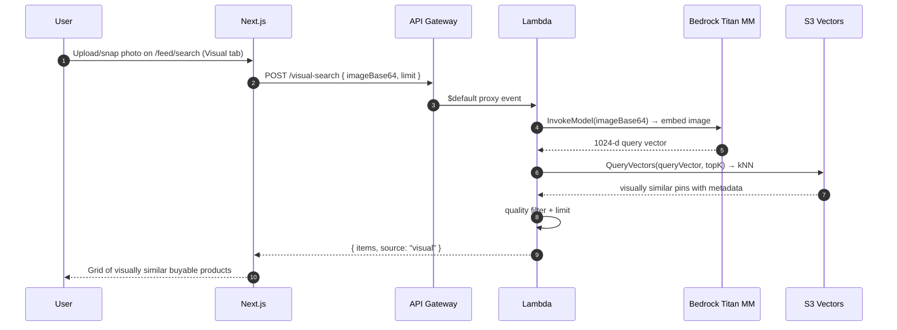
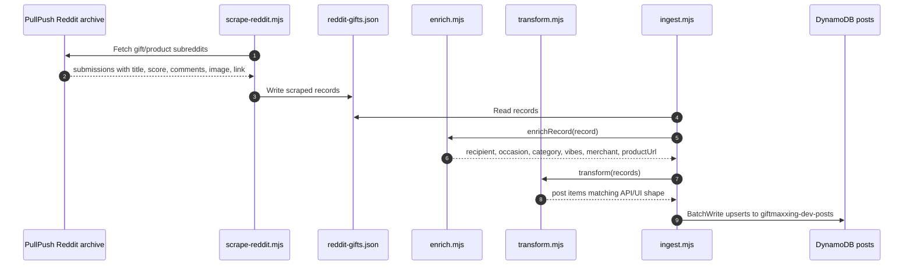
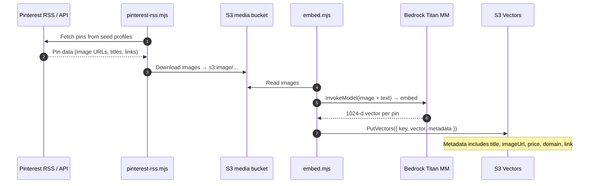

# Giftmaxxing Architecture

Full-stack social gifting platform: Next.js 16 on Vercel, serverless AWS backend
(DynamoDB + S3 Vectors + Bedrock + Lambda + API Gateway), Terraform IaC.

## System diagram

## Runtime request flow — personalized recommendations

## Visual search flow

## DynamoDB tables (8 tables, all on-demand + PITR)

| Table | Keys | Purpose |
|---|---|---|
| `users` | PK `userId` | Profiles / identity |
| `posts` | PK `postId`; GSI `byAuthor`, GSI `byFeed` | Feed items; powers profile grids and global feed index |
| `interactions` | PK `userId`, SK `targetId` | Likes / saves / comments (idempotent) |
| `knowledge` | PK `recipient` | Reddit-mined gift ideas per recipient type |
| `events` | PK `userId`, SK `eventId`; GSI `byScope` | Personal milestones + shared occasions |
| `graph` | PK `pk`, SK `sk`; GSI `byEntity` | Single-table adjacency: onboarding + taste graph |
| `connections` | PK `userId`, SK `connectionId` | Soft profiles from swipe challenge guests |
| `config` | PK `key` | Feature flags + cost kill-switch |

## Offline data pipeline

## Pinterest → S3 Vectors embedding pipeline

## Key API routes (Lambda handler.mjs)

| Method | Path | Purpose |
|---|---|---|
| GET | `/feed` | Paginated social feed with freshness + de-dup |
| GET | `/recommendations` | Personalized picks via S3 Vectors kNN or facet fallback |
| POST | `/visual-search` | Image → Titan MM embed → kNN visual search |
| POST | `/interactions` | Record likes / saves / comments |
| POST | `/maxi` | AI gift concierge (Nova base / Haiku shopping) |
| GET | `/posts/:id` | Single post detail |
| GET | `/knowledge` | Gift ideas by recipient |
| POST | `/events` | Create/update user events |
| GET | `/connections` | List soft profiles |

## Important implementation details

- Public API base: `https://tvyu8gqmki.execute-api.us-east-1.amazonaws.com` (set as `NEXT_PUBLIC_API_URL`).
- Lambda reads table names from env vars (`USERS_TABLE`, `POSTS_TABLE`, etc.).
- `/feed` and `/recommendations` use opaque base64url cursors; `/feed` may encode a DynamoDB `LastEvaluatedKey` or an `_offset` fallback depending on the code path.
- Cost kill-switch: breaker Lambda sets `{ paused: true }` in the config table when spend exceeds threshold; expensive routes (Bedrock, S3 Vectors) short-circuit while basic feed/auth keeps serving.
- Vector recommendations fall back to a facet-based ranker over DynamoDB when S3 Vectors is unavailable or has no seed data.
