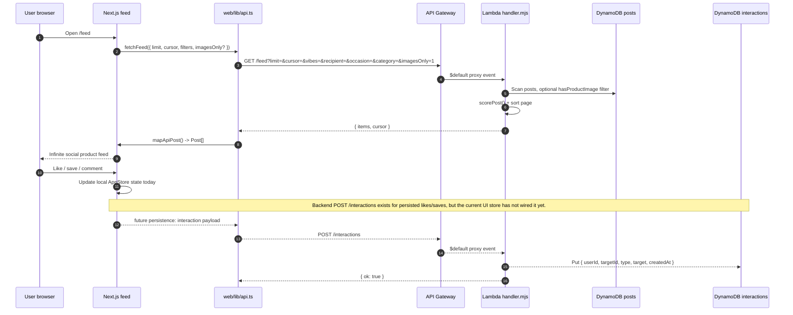
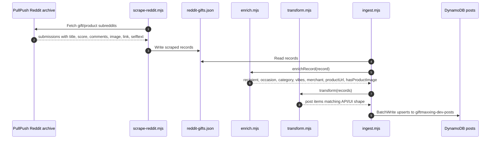

# Giftmaxxing Architecture

This diagram represents the current deployed Giftmaxxing system plus the near-term commerce layer we are building toward.

## System diagram

```mermaid
flowchart LR
  subgraph Users[Users]
    Hunter[Product Hunt visitor]
    User[Giftmaxxing user]
  end

  subgraph Web[Next.js web app]
    Landing[Landing page]
    FeedUI[Social feed UI]
    AppStore[AppStore / infinite scroll]
    ApiClient[web/lib/api.ts\nNEXT_PUBLIC_API_URL]
    LocalFallback[Local demo fallback\nPOSTS + client ranker]
  end

  subgraph ProductSources[Discovery and product sources]
    PullPush[PullPush Reddit archive API]
    RedditScraper[web/scripts/scrape-reddit.mjs]
    RedditJson[web/lib/reddit-gifts.json]
    FutureProductApis[Planned product search APIs\nSerpApi / RapidAPI / eBay / Best Buy / Walmart]
    AffiliateNetworks[Planned monetization layer\nSovrn / Skimlinks / Impact / EPN]
  end

  subgraph Ingest[Offline enrichment + ingestion]
    Enrich[infra/ingest/enrich.mjs\nrecipient / occasion / category / vibes\nmerchant / productUrl / hasProductImage]
    Transform[infra/ingest/transform.mjs\nDynamoDB post shape]
    IngestScript[infra/ingest/ingest.mjs\nBatchWrite + retry]
  end

  subgraph AWS[AWS us-east-1 account 445056752928]
    APIGW[API Gateway HTTP API\ngiftmaxxing-dev-api\n$default proxy + CORS]
    Lambda[Lambda Node.js 20\ngiftmaxxing-dev-api\ninfra/src/handler.mjs]
    Logs[CloudWatch logs]

    subgraph DynamoDB[DynamoDB on-demand + PITR]
      UsersTable[(giftmaxxing-dev-users\nPK userId)]
      PostsTable[(giftmaxxing-dev-posts\nPK postId\nGSI byAuthor author + createdAt)]
      InteractionsTable[(giftmaxxing-dev-interactions\nPK userId / SK targetId)]
    end
  end

  subgraph ApiRoutes[Lambda routes]
    FeedRoute[GET /feed\ncursor pagination\nscorePost ranking\noptional imagesOnly filter]
    RecsRoute[GET /recommendations\ninteraction-aware ranking\nfacet filters + imagesOnly]
    PostRoute[GET /posts/{id}]
    InteractionsRoute[POST /interactions\nlike / save / comment ids]
    SeedRoute[POST /seed\ndev bulk load]
  end

  Hunter --> Landing
  User --> FeedUI
  Landing --> FeedUI
  FeedUI --> AppStore
  AppStore --> ApiClient
  AppStore -. if API unset/unreachable .-> LocalFallback

  ApiClient -->|GET /feed by default\nGET /recommendations available| APIGW
  ApiClient -. planned persisted likes/saves .-> APIGW
  APIGW --> Lambda
  Lambda --> FeedRoute
  Lambda --> RecsRoute
  Lambda --> PostRoute
  Lambda --> InteractionsRoute
  Lambda --> SeedRoute
  Lambda --> Logs
  APIGW --> Logs

  FeedRoute --> PostsTable
  RecsRoute --> PostsTable
  RecsRoute --> InteractionsTable
  PostRoute --> PostsTable
  InteractionsRoute --> InteractionsTable
  SeedRoute --> UsersTable
  SeedRoute --> PostsTable

  PullPush --> RedditScraper --> RedditJson --> Enrich --> Transform --> IngestScript --> PostsTable
  FutureProductApis -. enrich real images / prices / merchants .-> Enrich
  AffiliateNetworks -. wrap productUrl / outbound buy links .-> ApiClient

  classDef live fill:#f7f2eb,stroke:#211a14,color:#211a14;
  classDef aws fill:#fff4df,stroke:#fb6f52,color:#211a14;
  classDef planned fill:#f2eefc,stroke:#8b6fe8,stroke-dasharray: 5 5,color:#211a14;
  classDef data fill:#eaf6ef,stroke:#5b8c6a,color:#211a14;

  class Hunter,User,Landing,FeedUI,AppStore,ApiClient,LocalFallback live;
  class APIGW,Lambda,Logs,FeedRoute,RecsRoute,PostRoute,InteractionsRoute,SeedRoute aws;
  class PullPush,RedditScraper,RedditJson,Enrich,Transform,IngestScript data;
  class FutureProductApis,AffiliateNetworks planned;
```

## Runtime request flow



## Offline data pipeline



## What is live vs planned

| Layer | Live now | Planned next |
|---|---|---|
| Frontend | Next.js landing + social feed, infinite scroll, local fallback | Product Hunt asset flow, stronger onboarding, social imports |
| Backend | API Gateway `$default` → single Lambda router | Split services only if load/ownership requires it |
| Storage | DynamoDB users/posts/interactions, on-demand + PITR | Additional GSIs if feed scans become the bottleneck |
| Recommendations | Server-side `scorePost()` for API pages; local client fallback ranker | Embeddings, co-save graph, Pinterest/Spotify taste signals |
| Product sourcing | Reddit/PullPush scrape + rule-based enrichment | Product search APIs for real titles/images/prices/merchants |
| Monetization | `productUrl` field exists in API shape | Affiliate wrapping via Sovrn/Skimlinks/Impact/EPN |

## Important implementation details

- The public API base is `https://tvyu8gqmki.execute-api.us-east-1.amazonaws.com`, set as `NEXT_PUBLIC_API_URL` for the web app.
- The Lambda reads table names from `USERS_TABLE`, `POSTS_TABLE`, and `INTERACTIONS_TABLE`.
- `/feed` and `/recommendations` are cursor-paginated with base64url-encoded DynamoDB `LastEvaluatedKey` cursors.
- `fetchFeed()` defaults to `imagesOnly=1`, so the feed asks for posts where `hasProductImage = true`.
- `POST /interactions` exists in the Lambda, but current `AppStore` like/save/comment actions are local-only until persistence is wired.
- The web app falls back to local demo data and `web/lib/recommend.ts` if the API is not configured or unreachable.
