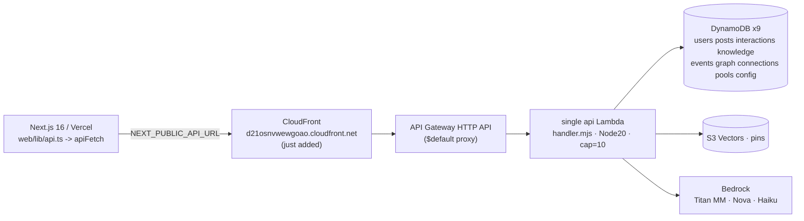
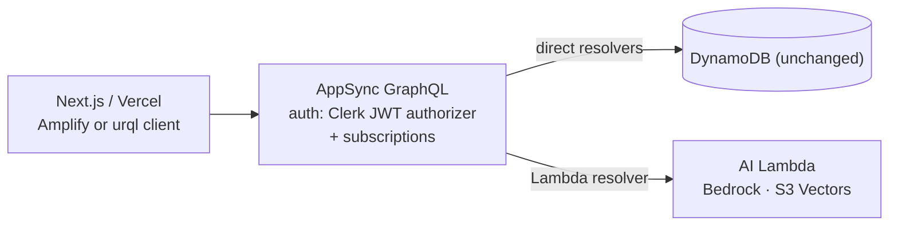

# Backend Scaling Design — getting off the Lambda concurrency cap

**Status:** Draft for decision · **Owner:** TBD · **Date:** 2026-06-27

## 1. Problem

Group-gift pooling (and the app generally) is intermittently unstable: the pools
list shows "No group gifts yet", a pool opens to "We couldn't find this group
gift", and a refresh fixes it. Measured live: **~83–90% of `/feed` requests
return `503 {"message":"Service Unavailable"}`**.

Root cause (confirmed): the AWS account's **Lambda "Concurrent executions"
quota is `10`** (`aws service-quotas get-service-quota lambda L-B99A9384` → `10`),
shared across **all three** functions (`api`, `breaker`, `reminders`). Every
frontend read and write funnels through the single `api` Lambda, so a normal
session — which fans out many calls per page plus a 4s chat poll, while slow
`/maxi` Bedrock calls hold a slot for up to the 10s timeout — bursts past 10
concurrent and the overflow is throttled (503) by API Gateway *before* the
function runs.

The `503` is a pre-invocation throttle, **not** a code exception (those would be
`500`). The handler is already well-guarded (outer try/catch, fail-open helpers),
so hardening exception handling does not change this. **Only reducing/removing
the Lambda funnel fixes it.**

## 2. Current architecture (as-is)

- **One Lambda does everything** behind one API Gateway. Auth (Clerk JWT /
  `x-admin-token`) is checked in-handler.
- **9 DynamoDB tables**, all PAY_PER_REQUEST + PITR. GSIs: `byFeed`, `byAuthor`,
  `byCategory` (posts), `byMember` (pools), `byScope` (events), `byEntity`
  (graph). DynamoDB itself is **not** the bottleneck — it scales independently.
- A **CloudFront distribution in front of the API was just added** (separate
  apply this session); if wired to cache public GETs it already offloads some
  reads (see §6, lever C).
- Cost controls: tiered breaker (`config` flag) + budget kill switch. These
  degrade AI routes only; they never touch `/feed` or reserved concurrency.

### Route inventory — what truly needs server compute

| Class | Routes | Needs a server? |
|---|---|---|
| **Pure CRUD** (DynamoDB GetItem/Query/Put/Update) | `/feed`*, `/posts/:id`, `/knowledge`, `/interactions`, `/events`, `/connections`, `/pools/*` (create/list/detail/join/contribute/messages), `/recipients`, `/ideas` | **No** — only a thin auth check + DynamoDB call |
| **Compute / AI** | `/maxi` (Bedrock agent loop), `/visual-search` (Titan embed + kNN), `/recommendations` (S3 Vectors kNN), `/pins` (S3 Vectors) | **Yes** — credentials, vector DB, agent loop |
| **Admin** | `/seed` (ingest) | Server (admin-only) |

*`/feed` is CRUD **plus** the `scorePost` ranking — light CPU, but it is the one
piece of "smart" logic on an otherwise-dumb read. It's the main thing any
direct-to-DB option must relocate (see §5 cross-cutting: Ranking).

**Takeaway:** the large majority of request *volume* is dumb CRUD that does not
need Lambda at all. Only a small slice (AI) genuinely needs server compute. The
fix is to stop routing CRUD through the capped function.

## 3. Goals & constraints

- **G1** Remove the 10-concurrency ceiling for CRUD reads/writes.
- **G2** Keep AI (Bedrock / S3 Vectors) on real server compute.
- **G3** Preserve auth (Clerk for users, admin token for ingest).
- **G4** Keep the `scorePost` feed ranking working.
- **G5** Prefer minimal data migration (DynamoDB holds live data; Bedrock + S3
  Vectors are AWS-native and worth keeping).
- **G6** Bonus: replace polling (pools chat 4s) with realtime to cut load and
  improve UX.
- **Cost**: stay roughly in the current low-cost envelope; avoid surprises.

## 4. Options

### Option 0 — Raise the Lambda quota (no redesign)

Request Service Quotas `L-B99A9384` 10 → 1000 (likely needs an AWS Support case
on a dev account).

- **Effort:** minutes (+ AWS approval lead time).
- **Pros:** zero code change; the bottleneck disappears; current architecture is
  otherwise fine for the target scale.
- **Cons:** doesn't address polling load or give realtime; still a single-Lambda
  monolith; dependent on AWS approval.
- **Verdict:** **Do this regardless** as immediate insurance. Not mutually
  exclusive with any option below.

### Option 1 — Lift the existing API onto always-on compute (App Runner / Fargate / Fly)

Run `handler.mjs` unchanged as a long-lived Node service (wrap the handler in a
tiny HTTP server, or use the **AWS Lambda Web Adapter** so the same code runs in
a container). One Node process multiplexes hundreds of concurrent **I/O-bound**
DynamoDB calls on the event loop, so the per-invocation cap is gone. AI runs on
the same box (or stays on a dedicated Lambda).

- **Effort:** ~half a day. Near-zero rewrite (reuse all routing/auth/logic).
- **Pros:** kills the cap with the least change; keeps DynamoDB + Bedrock + S3
  Vectors; ranking/auth code unchanged; trivial to reason about.
- **Cons:** always-on (~$10–30/mo for a small App Runner/Fargate task), not
  scale-to-zero; you now manage a service + its URL/TLS (App Runner gives a URL
  out of the box). Heavy AI calls still share the box's CPU — mitigate by
  keeping `/maxi` on a separate Lambda or a second service.
- **Verdict:** **Best effort-to-payoff** if the priority is "stop the bleeding
  with what we have."

### Option 2 — AppSync + DynamoDB (AWS-native "Lambda only for AI")

Put **AWS AppSync** (GraphQL) in front of DynamoDB. CRUD types resolve **directly
to DynamoDB** (JS/VTL resolvers — no Lambda). Attach **Lambda resolvers only to
the AI fields** (`maxi`, `visualSearch`, `recommendations`). Auth via Clerk JWT
(Lambda authorizer) or Cognito. Use **GraphQL subscriptions** for the pools
group chat / contributions → **no polling**.

- **Effort:** ~days (schema, resolvers, auth, client rewrite of `web/lib/*`,
  realtime wiring, data access-pattern mapping).
- **Pros:** the literal answer to "use Lambda only for the AI agent"; CRUD never
  touches Lambda; **built-in realtime** (kills the 4s poll and a big chunk of
  load); keeps DynamoDB + Bedrock; managed scaling + auth.
- **Cons:** real migration; resolver mapping templates have a learning curve;
  `scorePost` ranking must move (precompute-on-write or a thin Lambda field);
  GraphQL client replaces the REST `apiFetch` layer.
- **Verdict:** **Best long-term shape** for a realtime social/pools app while
  staying AWS-native.

### Option 3 — API Gateway → DynamoDB direct (service proxy)

API Gateway (REST API) integrates directly with DynamoDB via VTL request/response
mapping — no Lambda for CRUD; keep AI on Lambda.

- **Effort:** ~1–2 days.
- **Pros:** sidesteps the cap; stays AWS-native; keeps DynamoDB.
- **Cons:** **VTL mapping templates** are clunky to author/maintain; no clean
  home for ranking; no realtime; testing/observability is poorer than code.
- **Verdict:** Works for pure CRUD, but worse DX than Option 1/2. Not recommended
  unless avoiding any always-on compute is a hard requirement.

### Option 4 — CRUD in Next.js Route Handlers on Vercel

Move dumb routes into `web/app/api/**/route.ts` calling DynamoDB with an IAM key
(Vercel env var). Leave AI on AWS Lambda.

- **Effort:** ~1–2 days (port routes; logic is portable JS).
- **Pros:** frontend already on Vercel; scales on Vercel's concurrency (not the
  AWS 10-cap); colocated with the app.
- **Cons:** splits backend across two clouds; long-lived **AWS credentials in
  Vercel** (use a least-privilege IAM user or OIDC); no realtime (still polling
  unless you add a pub/sub); two deploy targets.
- **Verdict:** Viable, but the cross-cloud split + creds management make it less
  clean than Option 1 or 2.

### Option 5 — Browser → DynamoDB directly (Cognito Identity Pool + fine-grained IAM)

Browser gets temp AWS creds (Cognito Identity Pool federated with Clerk) and
calls DynamoDB with the SDK, constrained by `dynamodb:LeadingKeys` policies.

- **Effort:** ~days + a security review.
- **Pros:** removes server entirely for owner-scoped CRUD.
- **Cons:** **security-heavy** (per-user IAM conditions; easy to get wrong);
  exposes table structure to the client; public/shared data (global feed, public
  pools) is awkward; no ranking; no realtime.
- **Verdict:** Not recommended for this app's mix of public + shared + private
  data.

### Option 6 — Third-party realtime backend (Supabase / Convex / Firebase)

Move data to a frontend-native DB with RLS + realtime; frontend talks to it
directly; AI stays on AWS.

- **Effort:** ~days + full data migration off DynamoDB.
- **Pros:** excellent DX, realtime, RLS, scales hard.
- **Cons:** migrates off DynamoDB; **loses AWS-native proximity** to Bedrock +
  S3 Vectors (cross-service hops); a second vendor.
- **Verdict:** Great in a vacuum, but the AWS-native AI stack makes this a harder
  sell than Option 2.

## 5. Cross-cutting concerns (any direct-to-DB option must answer)

- **Auth** — today the Lambda verifies Clerk JWT / admin token. Relocate to:
  Option 1 (unchanged, same code); Option 2 (AppSync Lambda authorizer validating
  Clerk JWT, or Cognito); Option 4 (verify Clerk JWT in the Route Handler);
  Option 5/6 (Cognito / RLS with Clerk JWT). Clerk supports all via JWT.
- **Feed ranking (`scorePost`)** — relocate by: keeping it server-side (Option 1
  unchanged; Option 4 in the Route Handler), **precomputing a score on write**
  (good for Option 2/3/5/6), or ranking client-side (last resort).
- **Realtime vs polling** — the pools chat polls every ~4s
  (`web/app/feed/pools/[id]/page.tsx`). Native realtime (Option 2 subscriptions;
  Option 6) removes this load entirely and improves UX. Options 0/1/3/4 keep
  polling unless a pub/sub is added (e.g., API Gateway WebSockets, Ably/Pusher).
- **AI isolation** — in every option, keep `/maxi`, `/visual-search`,
  `/recommendations`, `/pins` on dedicated compute so their slow Bedrock/S3V
  calls can't starve CRUD.
- **Migration risk** — Options 0/1 touch no data and are easily reversible.
  Options 2/3/4/5 change the access layer (reversible with effort). Option 6
  migrates the data store (hardest to reverse).

## 6. Complementary levers (do alongside any option)

- **A. Cut client fan-out / polling.** Slow the pools chat poll (4s → ~10s),
  dedupe `useMyPools` (it runs on both feed and messages), and stagger feed-load
  calls. Reduces concurrent burst size immediately. Low effort, in our control.
- **B. Keep `apiFetch` throttle-retry** (already shipped) as a safety net.
- **C. CloudFront caching of public GETs.** A CloudFront distribution
  (`d21osnvwewgoao.cloudfront.net`) already exists; caching `/feed`, `/pins`,
  `/posts/*` (short TTL) collapses many reads into cache hits → fewer Lambda
  invocations. Cheap, large win for read-heavy traffic; pairs well with Option 0
  or 1.

## 7. Comparison matrix

| Option | Effort | Kills cap | Realtime | Keeps DynamoDB | AI isolated | Migration risk |
|---|---|---|---|---|---|---|
| 0 Quota bump | minutes | ✓ (raises it) | ✗ | ✓ | shared* | none |
| 1 App Runner lift | ~0.5 day | ✓ | ✗ (add pub/sub) | ✓ | easy | very low |
| 2 AppSync + DDB | ~days | ✓ | ✓ built-in | ✓ | ✓ | medium |
| 3 APIGW→DDB direct | ~1–2 day | ✓ | ✗ | ✓ | ✓ | low–med |
| 4 Vercel routes | ~1–2 day | ✓ | ✗ (add pub/sub) | ✓ | ✓ | low–med |
| 5 Browser→DDB | ~days | ✓ | ✗ | ✓ | ✓ | medium |
| 6 Supabase/Convex | ~days | ✓ | ✓ built-in | ✗ migrate | ✓ | high |

*With a higher quota you can also give the AI Lambda reserved concurrency to
isolate it.

## 8. Recommendation (staged)

1. **Now (today):** Option 0 (quota bump) + lever A (trim polling/fan-out) +
   lever C (CloudFront-cache public GETs). This stabilizes pooling immediately
   with near-zero risk.
2. **Next (the real decoupling), pick one:**
   - If the priority is **fastest off-Lambda with least change** → **Option 1
     (App Runner lift)**.
   - If the priority is the **proper long-term realtime shape** (and fixing the
     pools chat/polling specifically) → **Option 2 (AppSync + DynamoDB)**.

Both keep DynamoDB, Bedrock, and S3 Vectors, and both reserve heavy compute for
the AI agent — directly delivering "use Lambda only for the AI agent."

## 9. Suggested migration plan for the recommended paths

### If Option 1 (App Runner lift)
1. Add a thin HTTP entry (`src/server.mjs`) that routes to the existing handler,
   **or** adopt the Lambda Web Adapter so `handler.mjs` runs unchanged.
2. Containerize (`Dockerfile`, Node 20); reuse `src/node_modules`.
3. Terraform an App Runner service (env vars = current Lambda env; IAM role with
   the same DynamoDB/Bedrock/S3V permissions).
4. Point `NEXT_PUBLIC_API_URL` (or CloudFront origin) at the App Runner URL.
5. Optionally keep `/maxi` on its own Lambda/service to isolate Bedrock latency.
6. Decommission or shrink the `api` Lambda once verified.

### If Option 2 (AppSync + DynamoDB)
1. Model a GraphQL schema over existing tables/access patterns (feed, posts,
   pools, messages, contributions, interactions, events, connections).
2. Direct resolvers for CRUD; **Lambda resolvers** for `maxi`, `visualSearch`,
   `recommendations`, `pins`.
3. Clerk JWT Lambda authorizer (or Cognito) for auth.
4. Add **subscriptions** for pool messages/contributions; delete the chat poll.
5. Replace `web/lib/*` REST calls with a GraphQL client; migrate screen-by-screen
   behind a flag.
6. Decide ranking: precompute `score` on post write, or a thin ranking field.

## 10. Open questions

- Target scale + budget ceiling (drives App Runner sizing vs AppSync).
- Is scale-to-zero (cost) a hard requirement? (favors Option 2/0 over Option 1.)
- Appetite for a client data-layer rewrite now (Option 2) vs later.
- Is the new CloudFront distribution intended as the canonical API entry? If so,
  cache policies for public GETs should be defined regardless of option.
