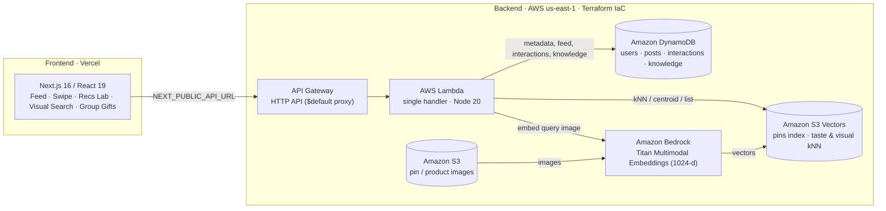

# Giftmaxxing — H0 Hackathon Submission Plan

**AWS Databases + Vercel Hackathon (`#H0Hackathon`)**

> You no longer need to choose between shipping quickly and using data infrastructure
> that holds up in real-world traffic. Giftmaxxing is built end-to-end on the exact
> stack this hackathon champions: a **Next.js frontend on Vercel** connected to a
> **production-grade AWS Database (Amazon DynamoDB)** — scaffolded over a weekend,
> architected to scale to millions on day one.

---

## 1. Submission at a glance

| Field | Value |
|---|---|
| **Project** | Giftmaxxing — a social gifting network ("Pinterest × Instagram for gifts") |
| **Primary track** | **Track 1 — Monetizable B2C** (ecommerce / retail / social commerce) |
| **Also qualifies for** | Track 3 — Million-scale Global App (social), Track 4 — Open Innovation |
| **AWS Database used** | **Amazon DynamoDB** (on-demand, multi-table, GSI) |
| **Supporting AWS** | Amazon S3, Amazon S3 Vectors, Amazon Bedrock (Titan Multimodal Embeddings), AWS Lambda, API Gateway HTTP API |
| **Frontend / deploy** | **Vercel** — Next.js 16, React 19, Tailwind v4 (`web/`, Root Directory = `web`) |
| **IaC / region** | Terraform · `us-east-1` |
| **Vercel Project Link** | **https://giftmaxxing.vercel.app** (live, auto-deploys on push to `main`) |
| **Vercel Team ID** | _**[HUMAN TODO: paste Team ID from Vercel dashboard → Settings → General → Team ID]**_ |
| **Demo video (<3 min)** | _**[HUMAN TODO: record and paste YouTube link — see script in §11]**_ |

---

## 2. The problem, the user, and why it matters

**Problem.** Gift-giving is high-intent but high-friction: people open 20 tabs, forget
occasions, double-buy the same present, and never really know a person's *taste*.
Existing tools are either dumb wishlists or generic marketplaces — neither learns who
you're buying for.

**Who it's for.** Everyday consumers (Track 1 B2C) who buy gifts for friends, family,
and partners — plus the social/viral layer that makes it a Track-3-scale network.

**Why we chose it.** Gifting is a massive, recurring, monetizable behavior (affiliate +
sponsored placements + group-gift payments) where a **taste model** creates real,
defensible value — and it's a natural fit for an AWS data foundation that has to serve
personalized feeds fast and cheap, then scale.

---

## 3. What we built

- **Taste-driven social feed** — an Instagram-style feed of real gift-worthy finds,
  ranked by a personalization engine (social proof + facets + embedding similarity).
- **"Would you want this gifted to you?" swipe-to-train** — a viral, Tinder-style deck.
  Every *yes* swipe becomes a **seed vector** that sharpens recommendations in real time
  (this is the growth loop + the data flywheel).
- **Recs Lab** — personalized picks powered by **S3 Vectors kNN** over a taste centroid.
- **Visual search ("Google Lens for gifts")** — snap/upload a photo → **Bedrock Titan
  Multimodal** embedding → nearest-neighbor product matches.
- **Group gifts & wishlists** — pool money toward one gift; claim items so nobody
  double-buys (the recipient stays surprised).
- **Maxi, the AI gift concierge** — surfaces ideas by recipient/occasion/budget from a
  Reddit-mined gift-knowledge base.

---

## 4. Architecture

**Request flow (example — personalized recommendations):**
1. Browser sends the user's liked/swiped pin keys as `seedKeys` to `GET /recommendations`.
2. Lambda fetches those pins' embeddings from **S3 Vectors**, averages them into a
   **taste centroid**, and runs a kNN query → ranked matches.
3. If no vectors are available, it **falls back to a facet ranker over DynamoDB**
   (social proof + recipient/occasion/category + recency).

---

## 5. AWS Database deep dive — **Amazon DynamoDB** (the designated DB)

DynamoDB is the operational data plane for the whole app. Single-digit-millisecond
reads, on-demand (pay-per-request) billing, point-in-time recovery, zero capacity
planning — i.e. **scale-to-zero economics today, scale-to-millions with no re-architecture.**

| Table | Keys | Purpose / access pattern |
|---|---|---|
| `users` | PK `userId` | Profiles / identity. |
| `posts` | PK `postId`; **GSI `byAuthor`** (`author`, `createdAt`); **GSI `byFeed`** (`feedPk`, `createdAt`) | Feed items; `byAuthor` powers profile grids; `byFeed` is the recency-ordered global feed index. |
| `interactions` | PK `userId`, SK `targetId` | Likes / saves / comments — **idempotent** by design; the server-side taste signal. |
| `knowledge` | PK `recipient` | Reddit-mined ranked gift ideas + co-occurrence bundles per recipient (mom, couple, coworker…). |
| `events` | PK `userId`, SK `eventId`; **GSI `byScope`** | Unified event store: personal milestones + shared occasions. Drives the time-aware gift recommender. |
| `graph` | PK `pk`, SK `sk`; **GSI `byEntity`** | Single-table adjacency model: hard onboarding data + soft swipe-derived taste as one connected graph. |
| `connections` | PK `userId`, SK `connectionId` | Soft profiles from invited guests who complete swipe challenges. |
| `config` | PK `key` | Feature flags + kill-switch state for cost controls. |

**Where it runs:** `infra/dynamodb.tf` (8 tables, GSIs, PITR on all) → `infra/src/handler.mjs`
(`@aws-sdk/lib-dynamodb`: `Get`/`Put`/`Query`/`Scan`/`BatchWrite`/`Update`/`Delete`).

> **Screenshot to include in the submission:** AWS Console → DynamoDB → Tables, showing
> all `giftmaxxing-dev-*` tables (users, posts, interactions, knowledge, events, graph,
> connections, config). _**[HUMAN TODO: capture from AWS Console]**_

---

## 6. Why we considered Aurora — and why we deliberately did not use it

The hackathon's three designated databases include **Amazon Aurora PostgreSQL**. Because
Giftmaxxing needs both (a) an operational metadata store **and** (b) a vector store for
recommendations, we genuinely evaluated **Aurora PostgreSQL (Serverless v2) + `pgvector`**
as a single "SQL + vectors in one engine" foundation for the scale-up phase.

**Decision: use DynamoDB (designated DB) + S3 Vectors instead.** The deciding factor was
the **tradeoff between the number of vectors we actually have and Aurora's cost profile.**

| Dimension | Aurora PostgreSQL Serverless v2 + `pgvector` | **DynamoDB + S3 Vectors (chosen)** |
|---|---|---|
| **Cost floor** | Minimum ACU billed **continuously** (always-on warm capacity) | **Scale-to-zero**; on-demand pay-per-request → ~pennies/mo at our scale |
| **Fit to our data volume** | Pays off at **>100k vectors** with real-time filtered ANN | Optimal at our **dozens → low-tens-of-thousands** of pin vectors |
| **Latency** | Low-latency ANN (HNSW/IVFFlat) | Single-digit-ms KV reads; S3 Vectors sub-second kNN |
| **Ops burden** | Instance/ACU tuning, index builds, `VACUUM`, VPC plumbing | Fully managed, no capacity planning, no VPC needed |
| **Scaling model** | Vertical / ACU scaling | Horizontal, virtually unbounded |

**The core reasoning:** our embedded set today is the gift/pin catalog (tens of vectors,
designed to grow into the tens of thousands). That is **well below the ~100k threshold**
where a relational ANN engine's always-on cost is justified. Paying an Aurora ACU-hour
floor 24/7 to serve a few thousand vectors with bursty, read-light traffic would have
**added fixed cost without adding value** — the opposite of the "ship fast, pay for what
you use" property this hackathon rewards. **DynamoDB** gives us a production-proven
metadata plane with true scale-to-zero economics, and **S3 Vectors** gives us a
purpose-built, lowest-TCO vector tier that *also* scales past 100k — so the entire data
foundation stays serverless.

**This decision is reversible by design.** If the catalog crosses ~100k vectors and we
need real-time *filtered* ANN, our documented path (`CLOUD.md` §3/§11) is to add a hot
tier — **OpenSearch Serverless or Aurora PG + `pgvector`** — **behind the same Lambda,
without touching the DynamoDB metadata plane.** We chose the right tool for our current
scale while keeping the on-ramp to Aurora open.

---

## 7. Production-readiness & scale (judging: "shippable software", Best Technical Implementation, Million-scale)

- **Fully serverless, scale-to-zero → scale-to-millions:** Vercel edge + Lambda +
  DynamoDB on-demand + S3 Vectors. No instance to babysit; cost tracks usage.
- **No re-architecture to grow:** DynamoDB on-demand and S3 Vectors both scale
  horizontally; the documented hot-tier path covers >100k-vector latency needs.
- **Infrastructure as Code:** entire backend in Terraform (`infra/`), reproducible in
  `us-east-1`; PITR on every table.
- **Graceful degradation:** vector path → facet-ranker fallback over DynamoDB, so the
  feed never goes blank.
- **Clean separation:** stateless Lambda behind an HTTP API; frontend talks to it via a
  single `NEXT_PUBLIC_API_URL` — the canonical Vercel ⇄ AWS pattern.

---

## 8. Monetization (judging: "Monetizable B2C")

- **Affiliate commerce** — every recommended/visual-search result links out to buyable
  products (Amazon Associates / Walmart-style affiliate links).
- **Native sponsored placements** — same `PostCard`, subtle "Sponsored" label,
  **ranked by the same taste vector** (Pinterest-style "can't-tell-it's-an-ad" inventory).
- **Group-gift payments** — take-rate on pooled-money gifts.
- **The data flywheel** — swipes/likes continuously improve the taste model, which lifts
  both conversion and ad relevance.

---

## 9. How this maps to the prize categories

| Prize | Our angle |
|---|---|
| **Monetizable B2C (1st–3rd)** | Consumer gifting + affiliate/sponsored/group-gift revenue; clear path to a side-hustle → venture. |
| **Best Technical Implementation** | DynamoDB access-pattern design + Bedrock multimodal embeddings + S3 Vectors kNN, all serverless & IaC; deliberate Aurora-vs-DynamoDB tradeoff. |
| **Best Design** | Polished Instagram/Pinterest-grade UI (Tailwind v4), swipe deck, cohesive design system. |
| **Most Impactful** | Removes real gifting friction (double-buys, forgotten occasions, taste-blind picks). |
| **Most Original** | "Would you want this gifted to you?" swipe-to-train growth loop feeding a live vector recommender. |
| **Million-scale (Track 3)** | Architected to scale to millions globally with scale-to-zero economics. |

---

## 10. Submission checklist (exact deliverables)

- [x] **Text description** stating the AWS Database used → **Amazon DynamoDB** (draft in §1/§5).
- [ ] **<3-min demo video (YouTube)** — problem → who/why → working app footage → AWS DB used (script in §11). **[HUMAN TODO]**
- [x] **Published Vercel Project Link** — **https://giftmaxxing.vercel.app**
- [ ] **Vercel Team ID** — **[HUMAN TODO: Vercel dashboard → Settings → General → Team ID]**
- [x] **Architecture diagram** — `screenshots/architecture-diagram.png` (rendered from §4 Mermaid).
- [ ] **Screenshot proving AWS Database usage** — AWS Console DynamoDB tables. **[HUMAN TODO: screenshot all `giftmaxxing-dev-*` tables from AWS Console]**
- [ ] **(Bonus) Published content** with `#H0Hackathon` + the required "created for this hackathon" disclaimer (plan in §12). **[HUMAN TODO]**

---

## 11. Demo video script (<3 minutes)

1. **0:00–0:20 — Hook & problem.** "Gifting is high-intent but a mess — 20 tabs,
   double-buys, no idea what someone actually likes." Who it's for, why we picked it.
2. **0:20–1:40 — Working app.** Live feed → **swipe deck** ("Would you want this gifted
   to you?") → show recommendations sharpen → **visual search** with a photo →
   group-gift pool.
3. **1:40–2:30 — The stack.** Frontend on **Vercel**; backend on AWS. State clearly:
   **"We use Amazon DynamoDB"** for users/posts/interactions/knowledge; S3 Vectors +
   Bedrock for the taste engine. Show the AWS Console DynamoDB screenshot.
4. **2:30–3:00 — Scale & the Aurora call.** "We evaluated Aurora PostgreSQL + pgvector,
   but at our vector volume DynamoDB + S3 Vectors gave production performance with
   scale-to-zero cost — and a clean path to add Aurora/OpenSearch at >100k vectors."

---

## 12. Bonus content plan (`#H0Hackathon`)

- **Blog post** (dev.to / Medium / builder.aws.com / LinkedIn): *"Choosing DynamoDB +
  S3 Vectors over Aurora for a weekend-built, production-ready gifting app."* Cover the
  Vercel ⇄ AWS pattern, the DynamoDB access-pattern design, and the cost-vs-vector-volume
  tradeoff. Include the line: *"I created this content for the purposes of entering the
  AWS Databases + Vercel Hackathon (#H0Hackathon)."* Do **not** publish unlisted.

---

## 13. Reproduce / deploy (proof)

- **Frontend (Vercel):** import the repo, set **Root Directory = `web`**, set
  `NEXT_PUBLIC_API_URL` to the API Gateway URL, deploy. (`web/vercel.json` present.)
- **Backend (AWS):** `cd infra && terraform apply` → provisions DynamoDB + Lambda +
  API Gateway + S3 in `us-east-1`; run `infra/ingest/` scripts to load data and build
  the S3 Vectors index.

> **Remaining human tasks for submission:**
> 1. ~~Confirm primary track~~ → **Track 1 (Monetizable B2C)** confirmed.
> 2. ~~Vercel Project Link~~ → **https://giftmaxxing.vercel.app** (live).
> 3. **[HUMAN]** Paste **Vercel Team ID** from Vercel dashboard → Settings → General.
> 4. **[HUMAN]** Record **<3-min demo video** and paste YouTube URL (see script §11).
> 5. **[HUMAN]** Capture **DynamoDB console screenshot** (AWS Console → DynamoDB → Tables → show all `giftmaxxing-dev-*` tables).
> 6. **[HUMAN]** Optionally write the bonus blog post (§12).
